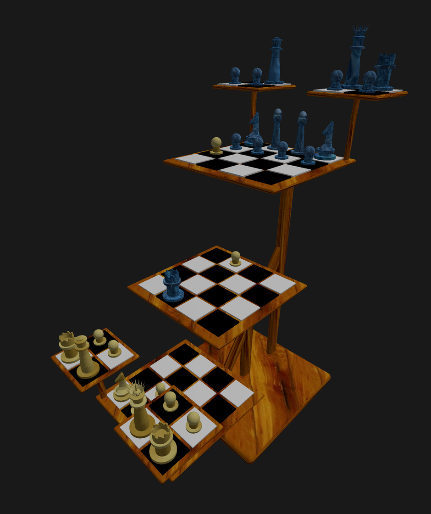

# ChessTriD
IOS Scenekit Tri-D chess board in Swift

Work in progress.
Demonstrates using Blender created 3D objects in a Scenekit project.
The chess board itself is the Tri-D layout, as played by Mr Spock.
For now, the app moves random pieces to random un-occupied squares, and
occasionally moves a random attack board to a different corner.

Note that 'tap piece or square' to toggle their selection is working,
so this COULD be made into a working chess game between two human players with a little more effort:
1. Add a state machine to track whose move it is, and whether they are "selecting the source piece",
or "selecting the destination un-occupied square or capture".
2. Add a way to move the attack boards. Simplest might be to just have 4 segmented Controls, 
where each board selects which of the 12 locations they should occupy.
3. Add an "undo" memory.

